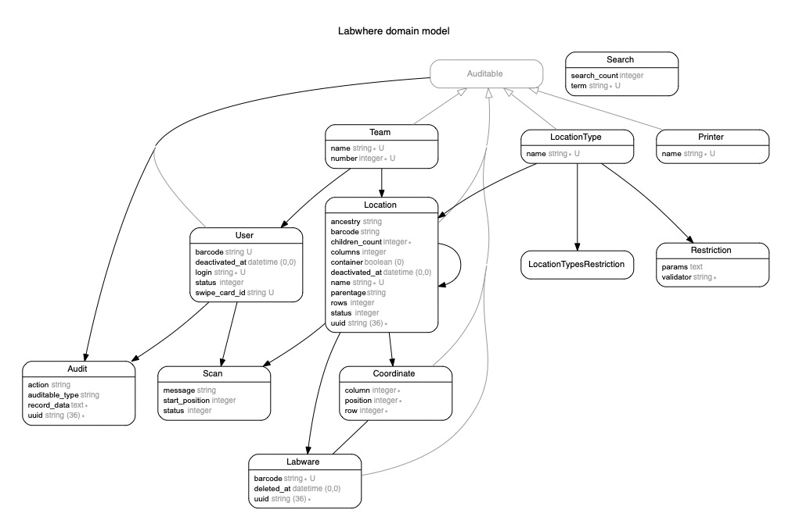

# Labwhere

[](https://github.com/sanger/labwhere/actions/workflows/automated_release_and_build.yml)

A tool for tracking uniquely barcoded labware

## Getting Started

1. Get the right Ruby version
Make sure you have the correct ruby version (in `.ruby-version` file) installed. e.g. `rvm install ruby-3.2.0`.

1. Create a new gemset and install bundler (if necessary)

    ```bash
    rvm use ruby-3.2.0@rails526 --create
    gem install bundler
    ```

1. Install dependencies:

    ```bash
    bundle install
    npm install
    ```

1. Remove the `.example` suffix from two files - `database.yml.example` and `bunny.yml.example`

1. Set up the local database

The local database uses `mysql`.

    ```bash
    bundle exec rails db:create
    bundle exec rails db:environment:set
    bundle exec rails db:schema:load
    ```

## Running The Specs

`bundle exec rspec`

## Running The Server

`bundle exec rails server`

## Generating the API Documentation

`bundle exec rails docs:api`

The documentation is written in [API Blueprint](https://apiblueprint.org/) and converted to HTML
using the [Apiary CLI client](https://github.com/apiaryio/apiary-client) gem.

The documentation will be available at `/api`.

## Creating some dummy data

`bundle exec rails db:reload`

This will create a user, location types and locations in a nested structure similar to the live setup.

## Generate the correct restrictions

`bundle exec rails restrictions:create`

This will limit certain location parentage when creating locations and other restrictions seen in app/data/restrictions

## Removing all of the data

`bundle exec rails db:clear`

This will remove all of the existing data without resetting the database.

## Creating some dummy labwares

`bundle exec rails labwares:generate_barcodes[num]`

num = number of labwares that will be created.

This will create a number of labware barcodes that can then be scanned into the scan page.

## Pages

* **Scan In/Out (home page):** Scan labwares into a Location

* **Upload Labware:** Upload Labwares into a location

* **Move Locations:** Move any number of locations from one place to another (all child locations will also be moved)

* **Empty Location:** Remove all labwares from a location

* **Configure:** Administrator permissions are required but these pages allow you to create/update/deactivate Location Types, Locations, Users, Teams and Printers

## Releases

#### UAT

Update `.release-version` with major/minor/patch. On merging a pull request into develop, a release will be created with the release version as the tag/name + -develop

### PROD

Merging develop into master will create a release with the same name as the latest develop release but without the -develop suffix. You do NOT need to update .release-version

### ERD

An ERD was created using the `rails-erd` gem by executing: `bundle exec erd`


